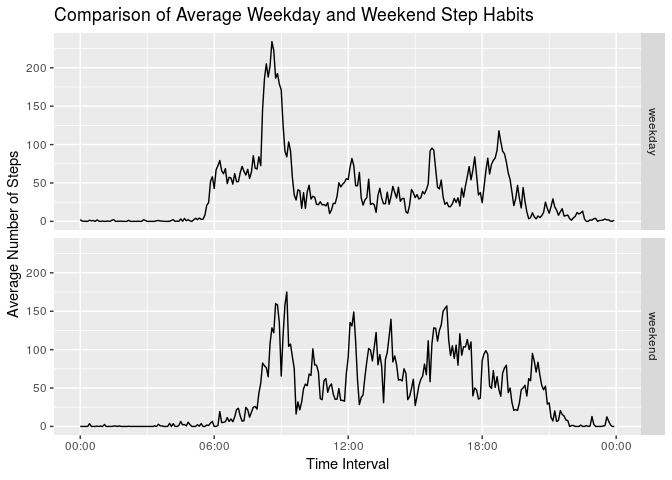

## Loading and preprocessing the data
Preparing for the data analysis involves three steps:

- Load relevant R libraries.
- Load data from the csv file.
- Compute additional columns needed for some of the analyses. 

Specific preprocessing includes converting the raw time numbers into POSIXct, and creating a factor indicating whether data is from a weekday or weekend.

```r
library("ggplot2")
library("scales")
library("dplyr")
```

```
## 
## Attaching package: 'dplyr'
```

```
## The following objects are masked from 'package:stats':
## 
##     filter, lag
```

```
## The following objects are masked from 'package:base':
## 
##     intersect, setdiff, setequal, union
```

```r
path <- "~/Documents/Coursera Data Science/05 Reproducible Research/RepData_PeerAssessment1/"
data_file <- paste(path, "activity.csv", sep = "")

raw_data <- read.csv(data_file)

activity_data <- mutate(raw_data,
                        # This creates time objects with today's date, but that's ok.
                        time_interval = as.POSIXct(sprintf("%04.0f", interval), format='%H%M'),
                        day_type = as.factor(ifelse(as.POSIXlt(date)$wday %in% c(0,6), "weekend", "weekday")))
```


## What is the mean total number of steps taken per day?
We first use a histogram to visualize the distribution of daily step counts, then calculate mean and median.


```r
day_grouping <- group_by(activity_data, date)
day_totals <- summarize(day_grouping, total_steps = sum(steps, na.rm = TRUE))

hist(day_totals$total_steps,
     main = "Histogram of Total Steps Per Day",
     xlab = "Total Steps")
```

<!-- -->

From the graph, it is clear that it is most common for the wearer to get between 10000-15000 steps per day, with few higher step count days. Thus, we'd expect the mean and median to bias toward the left of this peak, which we can confirm:


```r
mean_steps <- mean(day_totals$total_steps, na.rm = TRUE)
median_steps <- median(day_totals$total_steps, na.rm = TRUE)
```

The mean number of daily steps is 9354.23.

The median number of daily steps is 10395.

## What is the average daily activity pattern?
If instead we aggregate steps for the same time intervals on different days, we can gain an understanding of how activity level varies during the day.


```r
interval_grouping <- group_by(activity_data, time_interval)
interval_averages <- summarize(interval_grouping, average_steps = mean(steps, na.rm = TRUE))

with(interval_averages, {
  plot(time_interval,
       average_steps,
       type = "l",
       main = "Average Steps During 5-Minute Intervals Across the Day",
       xlab = "Interval Start Time",
       ylab = "Average Number of Steps")
})
```

<!-- -->

```r
interval_of_max = which.max(interval_averages$average_steps)
time_of_max = substr(interval_averages$time_interval[interval_of_max], 12, 16)
```

On average, the 5-minute interval with the most steps starts at: 08:35.

Perhaps unsurprisingly, we find that activity-level is low during typical sleeping hours from about 22:00 to 06:00. Activity is roughly distributed across daytime hours, with a spike in the morning (possibly indicating morning as a peak exercise time), and tapering off in the evening.

## Imputing missing values
Missing values can affect the quality of a data analysis, so we can quickly calculate how many step counts are missing in the given dataset.


```r
missing_value_count <- sum(is.na(activity_data$steps))
```

We find that there are 2304 missing entries, which is a significant fraction of the 2-month timeframe.

Given this information, we may choose to repeat our initial analysis after attempting to fill in missing entries with reasonable values. One option might be to use the *impute* package from the Bioconductor website. Here we apply a simpler technique, electing to replace missing values with the mean step count for the associated time interval.

After imputing missing values, we re-calculate the histogram, mean, and median.


```r
# Replace missing values with the per-interval mean
joined_activity_data <- inner_join(activity_data, interval_averages, by = "time_interval")
imputed_activity_data <- mutate(joined_activity_data,
                                steps = ifelse(is.na(steps), 
                                               average_steps, 
                                               steps),
                                average_steps = NULL)

imputed_day_grouping <- group_by(imputed_activity_data, date)
imputed_day_totals <- summarize(imputed_day_grouping, total_steps = sum(steps, na.rm = TRUE))

hist(imputed_day_totals$total_steps,
     main = "Histogram of Total Steps Per Day",
     xlab = "Total Steps")
```

<!-- -->

There are a couple observable differences between this histogram and the previous one. First, the largest bin (10000-15000 steps) is now more pronounced. Secondly, the low step count bin has diminished. This is expected, since the strategy for imputing essentially reinforced or emphasized data near the mean, and added steps to days which would have originally appeared to have low step counts.


```r
mean_steps <- mean(imputed_day_totals$total_steps, na.rm = TRUE)
median_steps <- median(imputed_day_totals$total_steps, na.rm = TRUE)
```

After imputing, the mean number of daily steps is 10766.19.

The median number of daily steps is 10766.19.

We see that imputing missing values pushed the mean and median upward, matching observations from the histogram.

## Are there differences in activity patterns between weekdays and weekends?
Using the weekday / weekend factor variable computed during data preprocessing, it is also possible to examine how time series trends vary on different types of days.


```r
day_type_grouping <- group_by(activity_data, time_interval, day_type)
day_type_averages <- summarize(day_type_grouping, average_steps = mean(steps, na.rm = TRUE))

comparison_plot <- ggplot(data = day_type_averages,
                          mapping = aes(time_interval, average_steps)) +
  facet_grid(day_type ~ .) +
  geom_line() +
  xlab("Time Interval") +
  ylab("Average Number of Steps") +
  ggtitle("Comparison of Average Weekday and Weekend Step Habits") +
  # Style the x-axis to remove the date portion of labels
  scale_x_datetime(labels = date_format("%H:%M", tz = Sys.timezone()))
print(comparison_plot)
```

<!-- -->

Comparing the two line graphs, we observe that active hours are shifted on weekends versus weekdays. The data indicates that the subject becomes active several hours later, indicating that they probably sleep in later and go to bed later on weekends. Another difference between the two panels is that weekdays exhibit a much stronger spike in activity early in the day. Whereas the weekday data suggests behavior that is more active in the morning, followed by a more sedentary afternoon, the weekend data indicates more uniform activity level across the day. 
